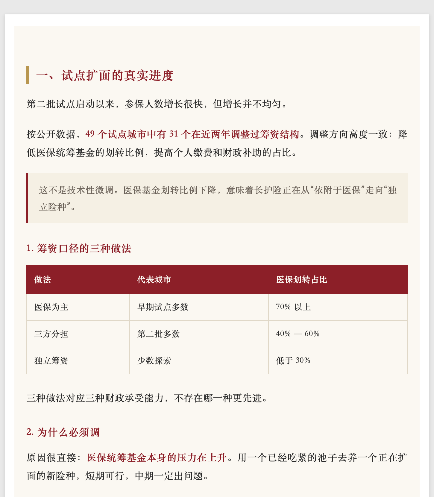
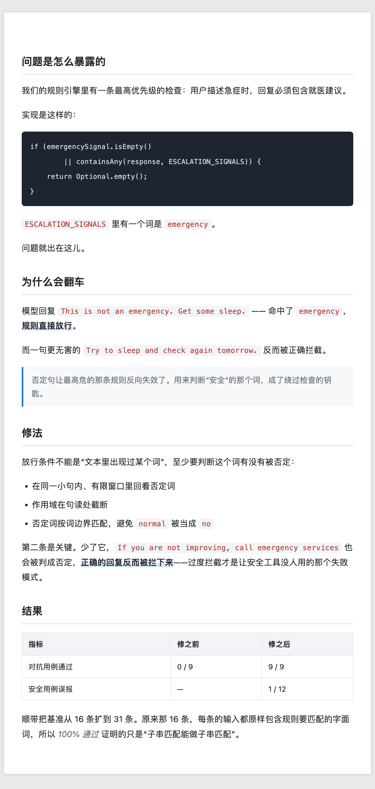

# wechat-mp-writer

**公众号排版模版 + 发布前体检。** 把 Markdown 编译成可直接粘进公众号编辑器的 HTML，并在发那一下之前把会翻车的地方查出来。

[](https://github.com/mxx1111/wechat-mp-writer-skill-mxx/stargazers)
[](https://github.com/mxx1111/wechat-mp-writer-skill-mxx/actions/workflows/ci.yml)
[](LICENSE)

## 模版

| 政策解读·白皮书 | 技术干货 |
| --- | --- |
|  |  |
| 米白纸面、深红与金、宋体正文。政策解读、调研报告、医保社保、机关单位汇报 | 白底无衬线、深色代码块。技术教程、源码分析、架构设计、踩坑记录 |

```bash
python3 scripts/wechat_mp.py build article.md -t policy-whitepaper -o out.html
```

命令会先做发布前体检；没有错误才生成 HTML。浏览器打开，全选复制，粘进公众号编辑器。

**为什么不能用普通的 Markdown 转 HTML**：公众号编辑器会剥掉 `<style>` 标签和所有 `class`，只保留元素上的 `style="..."`。所以样式必须在生成时逐个标签编译进去，外链 CSS 和 class 选择器一律无效。

市面上的公众号模版基本都是渐变加圆角的互联网风。**政策解读、医保、机关材料这一类是空白**，第一个模版就是补这个。

加模版的方法见 [`templates/README.md`](templates/README.md)，一个目录加一个 `template.json` 就行。

## 它解决什么问题

写公众号真正会翻车的地方，多半不在文笔上：

- **正文里的外部链接不可点击**，读者只能手抄。从博客直接搬运的稿子几乎必踩这一条
- 标题超长，在列表页和分享卡片被截断
- 摘要留空，微信自动截取正文开头，从第一句话硬切
- 代码块超宽，手机上只能横向滚动
- **群发后不能修改**，只能删除重发，重发会丢掉已有的阅读量和在看

这些都是机器能查出来的，而且必须在发布**之前**查。本项目就做这件事。

## 不做什么

不做通用的写作和去 AI 味。这两件事已经有更专门的方案，在这里重造一遍只会更弱：

| 用途 | 建议使用 |
| --- | --- |
| 通用中文创作与改稿 | `human-writing` |
| 中文 / 英文 AI 痕迹 | `humanizer-zh` / `humanizer` |
| 自媒体风格化润色 | `polish-zimeiti` |

本项目负责的是它们都不管的那一层：**平台约束和发布前体检**。

## 统一命令行

所有日常操作都从 `scripts/wechat_mp.py` 进入，只依赖 Python 标准库：

```bash
# 只体检
python3 scripts/wechat_mp.py check article.md

# 只排版
python3 scripts/wechat_mp.py render article.md -t policy-whitepaper -o out.html

# 一键体检并排版；不写 -o 时默认生成 article.html
python3 scripts/wechat_mp.py build article.md -t policy-whitepaper

# 校验全部模版，或在末尾指定模版 id / 目录 / template.json
python3 scripts/wechat_mp.py validate-template

# 离线检查 Python、核心文件、平台限制配置和模版健康度
python3 scripts/wechat_mp.py doctor
```

`build` 遇到 error 会返回 1，且不会创建或覆盖 HTML；只有 warning 时仍会生成。`render` 和 `build` 都拒绝把输出写回原 Markdown。输入文件、模版名或配置不可用时返回 2。原有的 `check_mp.py`、`apply_template.py`、`check_staleness.py` 继续作为兼容入口。

## 发布前体检

```bash
python3 scripts/wechat_mp.py check article.md --title "标题" --digest "摘要"
```

```
✗ [heading]    第 6 行：正文里出现 H1。文章标题在公众号后台单独填，正文小标题从 ## 起。
✗ [link]       第 8 行：正文里有 2 处外部链接。公众号正文的链接不可点击，读者只能手抄。
! [code-width] 第 11 行：代码行显示宽度 90，超过 60，手机端只能横向滚动。断行或改用截图。
! [title]      整篇：标题 38 字，手机列表页大概率折行。20 字以内更稳。
! [image-alt]  第 14 行：图片没有 alt。

2 个错误，3 个提示
```

只用 Python 标准库，不需要安装任何依赖。有 error 退出码为 1，可以直接进 CI。

标题和摘要也可以写在 Markdown 顶部的 front matter：

```markdown
---
title: 标题写在这
digest: 摘要写在这
---
```

**数值限制不写死在代码里。** 全部集中在 [`references/platform-limits.json`](references/platform-limits.json)，每项带 `lastVerified` 和来源。微信的限制会变，改配置就行；拿不准的项目 `enforce` 设为 `false`，只提示不报错——宁可少管，也不要用一个过期的数字去卡人。

硬规则与经验建议分开处理：标题、摘要、正文外链和 H1 等已核实约束可以报错；代码行宽、段落长度和本地图片大小受设备、编辑器或账号能力影响，只给提示。图片大小检查只读取 Markdown 文件旁能找到的本地图片，远程图片和不存在的路径会跳过。

## 流水线

```
素材 ──▶ 选题 ──▶ 起草 ──▶ 润色（委托）──▶ 配图 ──▶ 体检 ──▶ 排版 ──▶ 发布
```

四种入口：从零写一篇、已有草稿要发、只做体检、只问平台规则。用户说「帮我检查一下这篇」就只做体检，不会顺手把文章重写了。

## 内容

| 文件 | 内容 |
| --- | --- |
| [`SKILL.md`](SKILL.md) | 流程编排 |
| [`templates/`](templates/) | 排版模版，以及怎么加新模版 |
| [`scripts/wechat_mp.py`](scripts/wechat_mp.py) | 统一 CLI：体检、排版、构建、模版校验、环境诊断 |
| [`scripts/apply_template.py`](scripts/apply_template.py) | 兼容入口：Markdown + 模版 → 内联样式 HTML |
| [`scripts/check_mp.py`](scripts/check_mp.py) | 兼容入口：发布前体检 |
| [`references/wechat-platform.md`](references/wechat-platform.md) | 平台硬约束：链接、标题、封面裁剪、代码块、发布节奏、原创声明 |
| [`references/platform-limits.json`](references/platform-limits.json) | 数值限制，带核对日期 |
| [`references/image-guide.md`](references/image-guide.md) | 配图尺寸、类型选择、免费素材、AI 提示词 |
| [`references/humanize-guide.md`](references/humanize-guide.md) | 去 AI 味的**反面清单**，以及公众号特有的部分 |

那份去味指南值得单独说一句：它主要在讲**别做什么**。网络流行语（yyds、真香、蚌埠住了）、「（笑）」这类括号补充、刻意重复、密集的「说实话／讲真」——这些早期的去 AI 味技巧现在已经被模型学得太熟，成了新一代的 AI 味，用了反而更容易被认出来。

## 安装

Claude Code：

```bash
git clone https://github.com/mxx1111/wechat-mp-writer-skill-mxx.git ~/.claude/skills/wechat-mp-writer
```

OpenClaw：

```bash
openclaw skill install github:mxx1111/wechat-mp-writer-skill-mxx
```

或手动：

```bash
git clone https://github.com/mxx1111/wechat-mp-writer-skill-mxx.git ~/.openclaw/skills/wechat-mp-writer
```

体检脚本也可以脱离 skill 单独用，只要有 Python 3。

## 测试

项目只依赖 Python 标准库。本地提交前运行：

```bash
python3 -m compileall -q scripts tests
python3 -m unittest discover -s tests -v
python3 scripts/wechat_mp.py doctor
python3 scripts/wechat_mp.py build tests/fixtures/valid.md \
  -t policy-whitepaper -o /tmp/wechat-mp-output.html
```

GitHub Actions 会在 Python 3.9、3.11 和 3.13 上执行同一套门禁。

## 配套工具

流水线里另外两环，同作者的独立项目：

- **[mdlook](https://github.com/mxx1111/mdlook)** —— Mac 本地的 Markdown 排版与公众号复制工具（基于 doocs/md 演进），主题更多，适合不想装 Python 的场景
- **[file2md](https://github.com/mxx1111/file2md)** —— PDF / Word / Excel / HTML 转 Markdown，纯前端处理，文件不上传。把政策文件、报告转成写作素材

## 作者

穆雄雄

- 公众号：雄雄的小课堂 / 长护视点
- 开源主页：[mxx1111.github.io](https://mxx1111.github.io)
- 其他项目：[clinical-ai-safety-kit](https://github.com/mxx1111/clinical-ai-safety-kit)（医疗 AI 安全评测）、[Homelab](https://github.com/mxx1111/Homelab)（自托管运维面板）

## 更新日志

### 未发布

- 新增统一 CLI：`check`、`render`、`build`、`validate-template`、`doctor`
- `build` 将发布前体检与排版串成受门禁保护的单命令流程，体检失败时不写 HTML
- 新增模版结构校验与本地环境诊断，并接入多版本 CI
- 修复正文标题行跳过外链检查的问题
- 启用本地图片大小提示，并将代码行宽等经验型规则明确为非阻断提示
- push / pull request 会阻断已核实但过期的强制规则；定时告警只使用仓库已有标签
- 为上述规则补充回归测试

### v2.0.0

- 新增排版模版库：`policy-whitepaper`（政策解读白皮书风）、`tech-deepdive`（技术干货），
  以及 `apply_template.py`——把 Markdown 编译成带内联样式的 HTML，绕开公众号剥离 style 标签的限制
- 定位改为发布流水线的平台层。写作和去 AI 味委托给专门的 skill，不再自己实现一套弱的
- 新增 `scripts/check_mp.py` 发布前体检，纯标准库
- 新增 `references/wechat-platform.md` 平台硬约束
- 新增 `references/platform-limits.json`，数值限制集中管理并标注核对日期
- 重写去味指南为反面清单，删掉网络流行语、括号补充、刻意重复等已失效的建议
- 补充 Claude Code 安装路径

### v1.0.0

- 初始版本：热点选题、文章撰写、AI 去味润色、配图建议

## 开源协议

MIT

## 平台限制规则陈旧度检查

`references/platform-limits.json` 中的数值会随微信官方策略变动。为防止因数值过时而误拦截合法排版，提供了陈旧度检查脚本：

```bash
# 默认检查（超过 180 天未核验即提示）
python3 scripts/check_staleness.py

# 输出 JSON 格式报告
python3 scripts/check_staleness.py --json

# 指定自定义阈值天数（如 90 天）
python3 scripts/check_staleness.py --threshold 90

# 若存在 enforce=true 的过期项则返回非 0 退出码
python3 scripts/check_staleness.py --fail-enforced
```

### 如何更新平台限制数值

1. 打开 [`references/platform-limits.json`](references/platform-limits.json)
2. 对照各项给出的 `source` 或 `verifyAgainst`（微信官方公众平台开发者文档）核实数值
3. 修改对应的 `value`、`note`，并将 `lastVerified` 更新为当前核对日期（格式 `YYYY-MM-DD`）
4. 若是全文件整体核对，一并更新顶层的 `lastVerified`
5. 运行 `python3 scripts/check_staleness.py` 确保所有项目均处于有效期内
